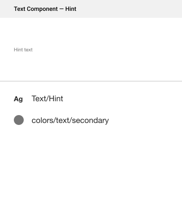

# Design Graph

##### The Design Graph is a constraint-based system for organizing styles in UI design. It consists of three parts: design tokens, theme and variants.

### Design Tokens

They define the visual characteristics of a brand or a product such as typography, colors, icons, and spacing. They make it easier to maintain a scalable, consistent system for UI development. Radius maintains all design tokens in a `theme.ts` file.

The theme is a collection of design tokens. You might have multiple versions of the theme. For example, to switch between different brands or perhaps color modes (dark & light). The shape of the theme object conforms to the [System UI Theme Specification](https://system-ui.com/theme/).

### Styled System

We use [Styled System](https://styled-system.com/getting-started) to connect component styles to design tokens. For example:

```js
// styled-components is a CSS-in-JS Library
import styled from 'styled-components';

// styled-system provides functions that add props to React components
// which allow you to control styles based on design tokens.
import { space, layout, color } from 'styled-system';

// The Box component is now connected to Space and Color tokens
export const Box = styled.div(space, color);
```

Now, this component will have style props available to set foreground color, background color, margin and padding values.

```js
/**
 * Color maps to theme.colors.textEditorial
 * background color maps to theme.colors.background[1]
 * Padding maps to theme.space[3]
 */
<Box color="textEditorial" bg="bg.primary" p={3}>
  Tomato
</Box>
```

### Variants

There are situations where you might want to support slight stylistic variations of components. For example, a button might have primary, secondary and transparent variants. Or typography variants similar to how text styles work in Sketch and Figma.

[Styled System variants](https://styled-system.com/variants) allow you to apply a set of visual styles to a component using a single prop. These variants also map to your design tokens, defined in `theme.ts`.
```js
// Design tokens in theme.ts
{
  fonts: {
    body: '"Helvetica Neue", sans-serif',
    heading: '"Roboto", sans-serif',
  },
  fontWeights: {
    regular: 400,
    medium: 500,
    bold: 700,
  },
  lineHeights: {
    solid: 1,
    title: 1.25,
    copy: 1.5,
  },
  fontSizes: [12, 14, 16, 20, 24, 32, 48]
}
```
```js
// Text variants
const textVariants = variant({
  variants:{
    body: {
      fontFamily: 'body',
      fontWeight: 'regular',
      lineHeight: 'copy',
      fontSize: 2,
    },
    caption: {
      fontFamily: 'body',
      fontWeight: 'medium',
      lineHeight: 'copy',
      fontSize: 2,
    },
    label: {
      fontFamily: 'heading',
      fontWeight: 'regular',
      lineHeight: 'solid',
      fontSize: 1,
    },
  }
})
```

The Text component can now use the `variant` prop to switch between lead, body and label styles.

```js
<Text variant="body" />
<Text variant="caption"  />
<Text variant="label" as="span" />
```

### Example


The Field component is a composed of `<Input />`, `<Label />`, `<Text variant="hint" color="text.secondary" />` and `<Text variant="hint" color="text.error" />`. Which in-turn use a composition of design tokens and variants.





## Further Reading

- [The Design Graph](https://jxnblk.com/blog/design-graph/) by Brent Jackson
- Styled system [variants API documentation](https://styled-system.com/variants)
- [Tokens in Design Systems](https://medium.com/eightshapes-llc/tokens-in-design-systems-25dd82d58421) by Nathan Curtis
