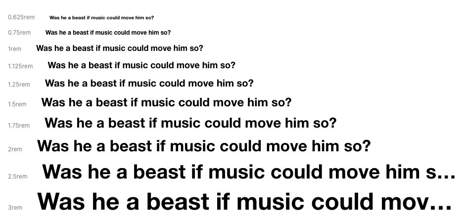

<Meta title="Foundations/Typography Tokens" />

# Typography Tokens

<Subtitle>
  Base font size is <code>16px</code> and using Helvetica Neue and Roboto font
  families.
</Subtitle>

**Font Weights:** `regular` `medium` `bold`

**Line Heights:** `solid` `title` `copy`

**Letter Spacings:** `default` `tracked`

### Typography Scale

